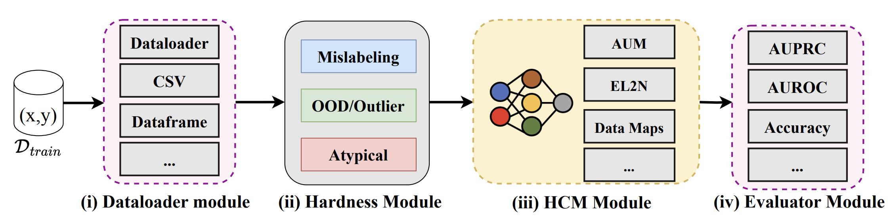

# Hardness Characterization Analysis Toolkit (H-CAT)


[](https://opensource.org/licenses/Apache-2.0)
[]()

---

## 📝 What is H-CAT? 

Data and hardness characterization are crucial in Data-Centric AI. 

Many methods have been developed for this purpose. H-CAT is a unified framework and API interface for 13 state-of-the-art hardness and data characterization methods --- making them easy to use and/or evaluate. 

We also include a benchmark capability that allows these hardness characterization methods (HCMs) to be evaluated on 9 different types of hardness.



## ✅ Supported Hardness characterization methods

| Method | Usage | Description | Reference |
| --- | --- | --- | --- |
| Area Under the Margin (AUM) | 'aum' | Characterizes data examples based on the margin of a classifier – i.e. the difference between the logit values of the correct class and the next class. | [AUM Paper](https://arxiv.org/abs/2001.10528) |
| Confident Learning |  'cleanlab' |  Confident learning estimates the joint distribution of noisy and true labels — characterizing data as easy and hard for mislabeling. | [Confident Learning Paper](https://arxiv.org/pdf/1911.00068.pdf) |
| Conf Agree | 'conf_agree' | Agreement measures the agreement of predictions on the same example. | [Conf Agree Paper](https://arxiv.org/pdf/1910.13427.pdf) |
| Data IQ | 'data_uncert' | Data-IQ computes the aleatoric uncertainty and confidence to characterize the data into easy, ambiguous and hard examples. | [Data-IQ Paper](https://arxiv.org/abs/2210.13043) |
| Data Maps | 'data_uncert' | Data Maps focuses on measuring variability (epistemic uncertainty) and confidence to characterize the data into easy, ambiguous and hard examples. | [Data-Maps Paper](https://arxiv.org/abs/2009.10795) |
| Gradient Normed (GraNd) | 'grand' |GraNd measures the gradient norm to characterize data. | [GraNd Paper](https://arxiv.org/abs/2107.07075) |
| Error L2-Norm (EL2N) | 'el2n' | EL2N calculates the L2 norm of error over training in order to characterize data for computational purposes. | [EL2N Paper](https://arxiv.org/abs/2107.07075) |
| Forgetting | 'forgetting' | Forgetting scores analyze example transitions through training. i.e., the time a sample correctly learned at one epoch is then forgotten. | [Forgetting Paper](https://arxiv.org/abs/1812.05159) |
| Small Loss | 'loss' | Small Loss characterizes data based on sample-level loss magnitudes. | [Small Loss Paper](https://arxiv.org/abs/2106.00445) |
| Prototypicalilty | 'prototypicality' | Prototypicality calculates the latent space clustering distance of the sample to the class centroid as the metric to characterize data. | [Prototypicalilty Paper](https://arxiv.org/abs/2206.14486) |
| Variance of Gradients (VOG) | 'vog' |VoG (Variance of gradients) estimates the variance of gradients for each sample over training | [VOG Paper](https://arxiv.org/abs/2008.11600) |
| Active Learning Guided by Local Sensitivity and Hardness (ALLSH) | 'allsh' | ALLSH computes the KL divergence of softmax outputs between original and augmented samples to characterize data. | [ALLSH Paper](https://arxiv.org/abs/2205.04980) |
| Detector | 'detector' | Detects hard samples directly on the training dynamics via a trained detection model | [Detector Paper](https://arxiv.org/abs/2212.09321) |

**Adding new methods**: New methods can be added via the base class ``Hardness_Base`` in ``src/hardness.py``

## 🚀 Installation

To install H-CAT, follow the steps below:

1. Clone the repository

2. Create a new virtual environment or conda environment with Python >3.7: 

    ```bash
    virtualenv hcat_env 
    ```
    OR
    ```bash
    conda create --name hcat_env
    ```

3. With the environment activated, run the following command from the repository directory:

    ```bash
    pip install -r requirements.txt
    ```

4. Link the venv or conda env to the kernel:

    ```bash
    python -m ipykernel install --user --name=hcat_env
    ```

## 🛠️ Usage of H-CAT

There are two ways to get started with H-CAT:

1. Have a look at the tutorial notebook: `tutorial.ipynb` which shows you step by step how to use the different H-CAT modules.

2. Using H-CAT on your own data --- you could follow the steps in the tutorial notebook.

3. Running a benchmarking evaluation as in our paper. `run_experiment.py` runs different experiements. These can be triggered by bash scripts. We provide examples in `run.sh` or `run_tabular.sh`.

Below is a simple example of how to use H-CAT:

```bash
# Set the parameterizable arguments
total_runs=3
epochs=10
seed=0
hardness="uniform"
dataset="mnist"
model_name="LeNet"
python run_experiment.py --total_runs $total_runs --hardness $hardness --dataset $dataset --model_name $model_name --seed $seed --prop 0.1 --epochs $epochs
```


Detailed commands:
```
# Usage: python run_experiment.py [OPTIONS]

or 

python run_experiment_tabular.py [OPTIONS]

# Options:
#   --total_runs INTEGER          Number of independent runs
#   --seed INTEGER                Seed
#   --prop FLOAT                  Proportion of samples perturbed (0.1-0.5)
#   --epochs FLOAT                Training epochs to get training dynamics
#   --hardness [uniform|asymmetric|adjacent|instance|ood_covariate|zoom_shift|crop_shift|far_ood| atypical]   Hardness types
#   --dataset [mnist|cifar|diabetes|cover|eye|xray]  *run_experiment.py if image datasets [cifar, mnist] and run_experiment_tabular.py if tabular datasets [diabetes, cover, eye]
#   --model_name [LeNet|ResNet|MLP]   LeNet: LeNet Model (images), ResNet: ResNet-18 (Images), MLP: Multi-layer perceptron (tabular)     
```

**Analysis and plots:** 
Results from the benchmarking can be visualized using `analysis_plots.ipynb` (all other results) and/or `stability_plot.ipynb` (stability/consistency results). The values are pulled from wandb logs (see below).

**Hardness types:**
- "uniform": Uniform mislabeling
- "asymmetric": Asymmetric mislabeling
- "adjacent" : Adjacent mislabeling
- "instance": Instance-specific mislabeling
- "ood_covariate": Near-OOD Covariate Shift
- "domain_shift": Specific type of Near-OOD
- "far_ood": Far-OOD shift (out-of-support)
- "zoom_shift": Zoom shift  - type of Atypical for images
- "crop_shift": Crop shift  - type of Atypical for images
- "atypical": Marginal atypicality (for tabular data ONLY)


## 🔎 Logging
Outputs from experimental scripts are logged to [Weights and Biases - wandb](https://wandb.ai). An account is required and your WANDB_API_KEY and Entity need to be set in wandb.yaml file provided.


## 📄 License

This project is licensed under the Apache 2.0 License - see the [LICENSE](LICENSE) file for more details.

---
# Citing

If you find this repository useful in your research, please cite the following paper:

```
@inproceedings
{seedat2024hardness,
title={Dissecting sample hardness: Fine-grained analysis of Hardness Characterization Methods},
author={Seedat, Nabeel and Imrie, Fergus and van der Schaar, Mihaela},
booktitle={The Twelfth International Conference on Learning Representations},
year={2024}
}
```

---

<div align="center">
    <strong>Give a ⭐️ if this project was useful!</strong>
</div>

